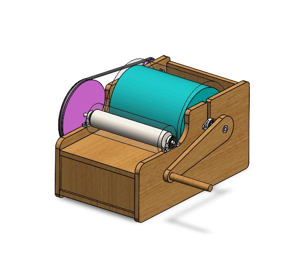

# Manual Drum Carding Machine

  

## Project Overview

Mechanical Manual Drum Carding Machine designed using SolidWorks. This project includes 3D part modeling, assembly, exploded view, BOM creation, and manufacturing drawings.

## Technical Specifications

- **Material:** Wood & Mild Steel
- **Software:** SolidWorks 2025
- **Drawing Standard:** ISO
- **Assembly Type:** Manual Machine

## Features

- 3D Part Modeling
- Assembly Design
- Exploded View
- Bill of Materials (BOM)
- 2D Manufacturing Drawings
- Isometric Drawing

## Files

- 📄 Manual_Drum_Carding_Machine_Isometric.pdf
- 📄 Manual_Drum_Carding_Machine_BOM.pdf
- 🖼️ Manual_Drum_Carding_Machine_Render.JPG

## Future Improvements

- Motion Study
- Manufacturing Drawings
- Detailed Part Drawings
- Design Optimization

---

**Designed by:** Durai Pandian  
**Software:** SolidWorks
